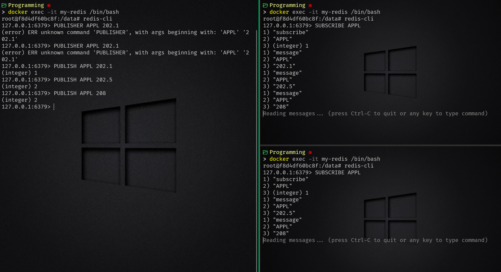
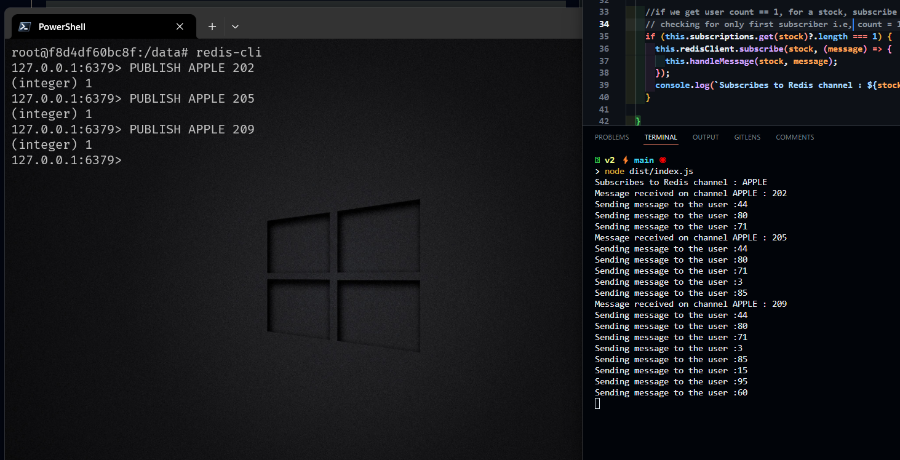

# Publish and Subscribe events

# Commands to Publish and Subscribe

### For Publishing

- PUBLISH APPL 202.1

### For Subscribing

- SUBSCRIBE APPL

## Stock Ticker

- first setup subscriber in Node.js app
- Now open redis-cli and publish APPLE stock like -
  - PUBLISH APPLE 203.3
  - PUBLISH APPLE 2204.5
- And our subscriber will be listening to our stock like :
  - SUBSCRIBE APPLE

